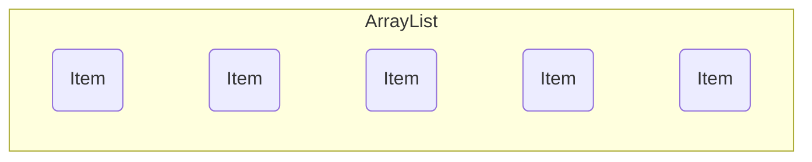
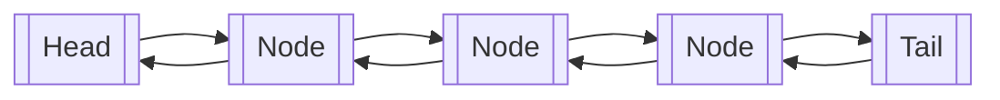

# Go Gather

[](https://opensource.org/licenses/MIT)

Go collections library mainly inspired by the Java collection framework.

> **Note:** This library is under development. The API is not stable and is
> subject to change.
---

## Data Structures

- [ ] [Collection](#collection)
    - [x] [List](#list)
        - [x] [ArrayList](#arraylist)
        - [x] [LinkedList](#linkedlist) - Doubly
    - [ ] Stack
    - [ ] Queue
    - [ ] Set
        - [ ] HashSet
        - [ ] TreeSet
        - [ ] LinkedHashSet
        - [ ] SortedSet
    - Map
        - [ ] HashMap
        - [ ] TreeMap
        - [ ] LinkedHashMap
        - [ ] SortedMap
    - [ ] Tree

## Collection

A collection is a group of elements. The `Collection` interface is the root
interface in the collection hierarchy and contains the following methods:

```go
package base

type Collection[T any] interface {
	Contains(element T) bool

	Clear()

	IsEmpty() bool

	Size() int

	Values() []T

	String() string
}
```

### List

A list is an ordered collection of elements. The List interface extends the
[Collection](#collection) interface and contains the following methods:

```go
package list

import "github.com/elias8/go-gather/base"

type List[T any] interface {
	base.Collection[T]

	Add(element T)

	Remove(element T) bool

	Set(index int, element T) (*T, bool)

	Get(index int) (*T, bool)

	IndexOf(element T) (int, bool)

	LastIndexOf(element T) (int, bool)
}

```

### ArrayList



An array list is a wrapper around a Go slice. It implements the [List](#list)
interface.

#### Usage

```go
package main

import "github.com/elias8/go-gather/list"

func main() {
	al := list.NewArrayList[int]()
	al.Add(1)                // [1]
	al.Add(2)                // [1, 2]
	al.Add(3)                // [1, 2, 3]
	_ = al.Contains(2)       // true
	_, _ = al.IndexOf(2)     // 1, true
	_, _ = al.LastIndexOf(2) // 1, true
	_, _ = al.Set(1, 4)      // [1, 4, 3], (returns 2, true)
	_, _ = al.Get(1)         // 4, true
	al.Clear()               // []
	_ = al.IsEmpty()         // true
	_ = al.Size()            // 0
}

```

#### LinkedList



A doubly linked list implementation of the [List](#list) interface. The
`LinkedList` contains the following methods in addition to the methods inherited
from the [List](#list) interface:

```go
package list

type LinkedList[T any] interface {
	List[T]

	AddFirst(element T)

	AddLast(element T)

	Reverse()

	RemoveFirst() (*T, bool)

	RemoveLast() (*T, bool)

	GetFirst() (*T, bool)

	GetLast() (*T, bool)

	IndexOf(element T) (int, bool)

	LastIndexOf(element T) (int, bool)
}
```

#### Usage

```go
package main

import "github.com/elias8/go-gather/list"

func main() {
	ll := list.NewLinkedList[int]()
	ll.Add(1)            // [1]
	ll.Add(2)            // [1 <-> 2]
	ll.Add(3)            // [1 <-> 2 <-> 3]
	ll.AddFirst(4)       // [4 <-> 1 <-> 2 <-> 3]
	ll.AddLast(5)        // [4 <-> 1 <-> 2 <-> 3 <-> 5]
	ll.Reverse()         // [5 <-> 3 <-> 2 <-> 1 <-> 4]
	ll.RemoveFirst()     // [3 <-> 2 <-> 1 <-> 4]
	ll.RemoveLast()      // [3 <-> 2 <-> 1]
	_, _ = ll.IndexOf(2) // 1, true
	_, _ = ll.Set(1, 6)  // [3 <-> 6 <-> 1] (returns 2, true)
	_, _ = ll.GetFirst() // 3, true
	_, _ = ll.GetLast()  // 1, true
	ll.Clear()           // []
	_ = ll.IsEmpty()     // true
	_ = ll.Size()        // 0
}
```

## Features and bugs

Feature requests are welcome. You can file feature requests, bugs, or questions
in the [issue tracker](https://github.com/elias8/go-gather/issues).

⭐️️ if you find this repo helpful. 😎

## Maintainer

| Name           |                                                                 GitHub                                                                  |                                                                      LinkedIn                                                                      |                                                            Twitter                                                            |
|:---------------|:---------------------------------------------------------------------------------------------------------------------------------------:|:--------------------------------------------------------------------------------------------------------------------------------------------------:|:-----------------------------------------------------------------------------------------------------------------------------:|
| Elias Andualem | [](https://www.github.com/elias8/) | [](https://www.linkedin.com/in/elias8/) | [](https://twitter.com/elias_andualem8) |                                    [issue_tracker_link]: https://github.com/elias8/go-gather/issues 
